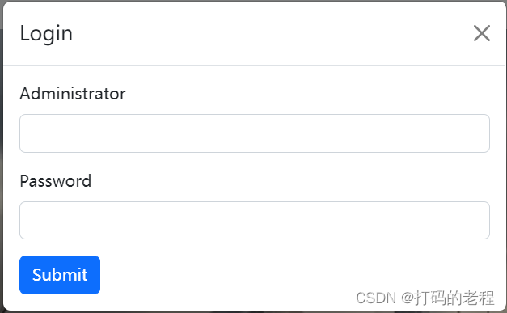

When you try to bind an event to an element of an HTML file, like sending a request to the server,  you will need to know how to combine a Javascript code to an HTML element. If you don't know how to achieve it, this article may help you. 

For example, if we have such a piece of HTML code like the following one:

```html
<div class="modal-dialog">
    <div class="modal-content">
        <div class="modal-header">
            <h5 class="modal-title" id="exampleModalLabel">Login</h5>
            <button type="button" class="btn-close" data-bs-dismiss="modal" aria-label="Close"></button>
        </div>
        <div class="modal-body">
            <form>
                <div class="mb-3">
                    <label for="ZeroInputAccount" class="form-label">Administrator</label>
                    <input type="text" class="form-control" id="inputAccount">
                </div>
                <div class="mb-3">
                    <label for="ZeroInputPassword" class="form-label">Password</label>
                    <input type="password" class="form-control" id="inputPassword">
                </div>
                <button id="submitLogin" type="submit" class="btn btn-primary">Submit</button>
            </form>
        </div>
    </div>
</div>
```

As you have seen, this HTML code will display a login form to the user, and the user should input the account name and password to log in to the backstage. 

This is what the form looks like.


Till now, when we click the submit button, nothing will happen. So, suppose the user has already filled out the form. They expect that when they click the button, the login information will be sent to the backend server, and the server should check and return the message and prompt something, like a popout window to tell the user something is wrong or just jump from the login page to backstage.

So the key to achieving the goal is to bind the element with a piece of Javascript code. And this is what the Javascript code looks like:

```javascript
<script type="text/javascript">
    $(document).ready(function() {
        $("#submitLogin").click(function() {
            var account = $("#inputAccount").val();
            var password = $("#inputPassword").val();
            if (account == "admin" && password == "admin") {
                alert("Login successfully!");
                // window.location.href = "projects.html";
            } else {
                alert("Login failed!");
            }
        });
    });
</script>
```

The mark *$(document).ready* tells the explorer when it loaded the HTML and rendered the page to the user, the explorer should bind the Javascript code to the elements and if it clicked, do the actions.

So which elements should be bonded depends on which IDs we decide to use. Therefore, we use *$(...)* to help us to achieve the purpose. Inside the rounded brackets, it is the ID of the element which we decide to bind.

As for this case, we decide to bind three elements, and their IDs are 'inputAccount', 'inputPassword' and 'submitLogin'. And I think you already know how to use it so far.

Ok, let's meet in the next article.