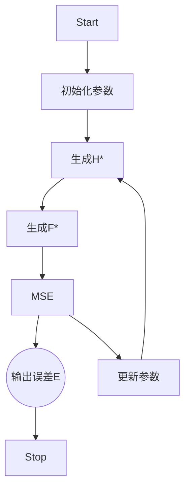

@[toc]

# 图像恢复的一般运算过程
我们从前几章的基本理论出发，退化信号恢复成原始信号的步骤，可以概括成两步基本公式。对于空间来说，有如下公式

$$
\left \{ \begin{matrix} 
g(x, y) = h(x, y) \odot f(x, y) + \eta(x, y) \\
\hat f(x, y) = \omega(x, y) * g(x, y) - \eta(x, y)
\end{matrix} \right.
$$

退化的过程，是由退化函数 $h(x, y)$ 与原图像 $f(x, y)$ 通过卷积，然后加上噪声函数 $\eta(x, y)$ 最终得到退化图像 $g(x, y)$；而恢复方法则是通过评估或建模恢复函数 $\omega (x, y)$ ，与退化后的图像 $g(x, y)$ 做运算后得到。

由于针对不同退化效果的还原运算方式的不同，这决定了 $\omega(x, y)$ 不一定是 $h(x, y)$ 的反运算，而且很难有通用的技巧可言。相比之下，图像恢复过程在频域上则简单许多，它的还原过程被表述如下：

$$
\left \{ \begin{matrix} 
G(u, v) = H(u, v) * F(u, v) + D(u, v) \\
\hat F(u, v) = G(u, v) * H(u, v)^{-1} - D(u, v)
\end{matrix} \right.
$$

希腊字母 Eta 的大写是 $\Eta$，为了跟已有的 H 做区别，这里改成了 D。可以看到，在频域下，只要得到退化函数的反函数，就可以直接得到还原图像 $\hat F$。另外稍微说一下，无论对于空间还是频域来说，评估图像的噪音函数并不困难，所以以上过程又经常被人省略了噪音的影响。

事实上，在做图像退化与恢复的研究时，经常会省略噪音函数的影响。

在上一章 [《数字图像学笔记——15. 图像退化与复原（使用逆滤波复原图像）》](https://seagochen.blog.csdn.net/article/details/120833477) 通过逆滤波函数已经演示了为什么在知道 $H(u, v)$ 的情况下，可以直接还原出图像 $\hat F(u, v)$。

现在我们需要来考虑一个更一般的问题，如果我们不知道导致图像退化的函数 $H(u, v)$ ，我们又应该如何还原图像呢。在这样一个假设前提下，有人提出了一类被称为的自适应的滤波方法，而「最小均方差滤波」就是诸多自适应滤波的其中一种。

# 什么是「最小均方差滤波」

最小均方滤波器（Least Mean Square Filter，或LMS Filter）是一类可通过最小化误差信号（error signal）的均方值（mean square）而修正滤波器系数，以模拟所需理想滤波器的自适应滤波器[^1]。

[^1]: https://zh.wikipedia.org/wiki/%E6%9C%80%E5%B0%8F%E5%9D%87%E6%96%B9%E6%BB%A4%E6%B3%A2%E5%99%A8

在冈萨雷斯版《数字图像处理》关于这一节中，老爷子并没有给出详细的证明或者推导过程，这对于第一次接触这个概念的朋友显然造成了困扰，而且这个问题显然在他最新版的著作里也没有得到修复。

所以，作为这本书的学习笔记，我只好先从信号学的角度出发，解释什么是最小均方差滤波。

> **补充信息**
> 关于自适应算法，能够考证到的文献应该来自于1959年，Widrow等人的论文「Adaptive pattern recognition system」。
> 有需求的朋友可以顺着这个线索自行查阅相关论文。
>
>

从信号学的角度看，「最小均方差」算法属于一种被称为「梯度下降」技术的应用扩展。

> **补充信息**
> 关于什么是梯度下降，有需要的朋友可以参考我这几篇文章内容。
> [深度学习知识总结—— 1.1. 什么是梯度下降](https://blog.csdn.net/poisonchry/article/details/116401539)
> [深度学习知识总结—— 1.2.梯度下降算法实现](https://blog.csdn.net/poisonchry/article/details/117419033)

它的评价指标，就是用均方差评价恢复的信号 $\hat F(u, v)$ 与原始信号 $F(u, v)$ 的离散程度。目标是找到一个能接受，趋近于 0 的误差。

所以，一般均方差公式尽管写为

$$
MSE = \frac{1}{n} \sum_{i=1}^{K} (y_i - \bar y)^2
$$

由于对于评价指标来说 $1/n$ 其实没什么必要性，所以你在信号学或者这本《数字图像处理》里，看到的就是下面这个样子

$$
E\{ e^2(n) \} = \{\hat F(n) - F(n) \} ^2
$$

和之前的内容稍微有点出入的是，我们这里需要考虑算法迭代 $n$。什么意思呢，在第一次运算后，我们的算法会给出一个 $H(u, v)_1^{-1}$ ，我们于是可以得出 $\hat F(1)$，它会与原始图像计算得到一个 $E\{ e^2(1) \}$；然后这个步骤会重复几次，最终得到一个 $E\{ e^2(n) \}$，而这时的误差应该最小，得到我们理想的结果。



听起来很简单，实现起来也不复杂，我们接下来看看算法的实现细节。

# 实现步骤

LMS 滤波器背后的基本思想是通过以收敛到最佳滤波器的方式更新滤波器权重 $R^{-1} P$ ，采取渐进地逼近策略，也就是梯度下降算法的根本思想。

对于我们来说 $\hat F(u, v) = G(u, v) * H(u, v)^{-1} - D(u, v)$ 其实可以看作矩阵的线性计算，$H(u, v)^{-1}$ 可以看作权重 $\omega(u, v)$，输入参数为 $G(u, v)$，输出参数为 $\hat F(u, v)$。噪音 $D(u, v)$ 可以当作偏移量 $b$，于是可以把运算过程表达为在矩阵中的基本线性计算

$$\hat y = \omega x + b$$

然后我们引入权重更新公式

$$
\hat \omega = \omega - \lambda \nabla (e^2)
$$

> **补充信息**
> 梯度下降的权重更新公式推导比较麻烦，我在这篇文章里就不再赘述，有需要的朋友可以看看我这篇文章的内容
> [深度学习知识总结—— 2. 计算图与反向传播](https://seagochen.blog.csdn.net/article/details/118082114)

由于梯度在计算过程中可能为负，也可能为正。也就是说，如果 MSE 梯度为正，则意味着将相同的权重用于进一步迭代，误差将继续正增加，这意味着我们需要减少权重。同样，如果梯度为负，我们需要增加权重。

为了方便计算，对于 $e^2$ 的求导运算，我们可以换成对梯度的差分计算。


> **补充信息**
> 关于梯度的差分运算，有需要的朋友可以看看我这篇文章的内容
> [浅谈矢量场 —— 1. 梯度、散度与拉普拉斯算子](https://seagochen.blog.csdn.net/article/details/114387703)

然后，我们把以上信息组合后，就可以得到 「最小均方差滤波」的实现方法。

1. 先将原始图像从 $f(x, y)$ 转化为 $F(u,v)$；
2. 再讲退化图像从 $g(x, y)$ 转化为 $G(u, v)$；
3. 初始化一个大小和 $G(u, v)$ 一样的权重矩阵 $W(u, v)$；
4. 设定更新率 $\lambda$，通常是小于 $< 1$ 的浮点数；
5. 由权重矩阵 $W$ 和原始图像 $F$ 计算得出一个退化图像 $G$；
6. 计算方差 $MSE$；
7. 更新权重矩阵 $W$，重复第5步；

看起来有点复杂，但是基本逻辑很简单。

# 实现代码

首先，我们要创建网络权重矩阵

```python
def create_parameters(dft):

    # generate empty matrix
    weight = np.ones_like(dft, dtype=np.float32)

    # return to caller
    return weight
```

然后创建一个用来计算均方差的函数，它主要帮助我们判断算法收敛情况。

```python
def compute_loss(dft_predicated, dft_target):

    # compute mse of original and recovery images
    new_errors = (dft_predicated - dft_target)**2

    # return sum
    return np.sum(new_errors)
```

然后一个通过导数更新参数的模块。为了方便理解，我们把导数部分以绝对值的形式表现出来，这样对于我们来说，接下来只需要关心在不同方向上，梯度的增减方向了。

```python
def backward(weights, dft_predicated, dft_target, lambs):

    # update value chain
    updated_val = np.absolute(lambs * (dft_predicated - dft_target))
    
    width, height, channel = dft_predicated.shape
    for w in range(width):
        for h in range(height):
            for c in range(channel):

                if dft_target[w, h, c] >= dft_predicated[w, h, c] >= 0:

                    if weights[w, h, c] >= 0:
                        weights[w, h, c] = weights[w, h, c] + updated_val[w, h, c]
                    else:
                        weights[w, h, c] = weights[w, h, c] - updated_val[w, h, c]

                    continue

                elif dft_predicated[w, h, c] >= dft_target[w, h, c] >= 0:

                    if weights[w, h, c] >= 0:
                        weights[w, h, c] = weights[w, h, c] - updated_val[w, h, c]
                    else:
                        weights[w, h, c] = weights[w, h, c] + updated_val[w, h, c]

                    continue

                elif 0 >= dft_target[w, h, c] >= dft_predicated[w, h, c]:

                    if weights[w, h, c] >= 0:
                        weights[w, h, c] = weights[w, h, c] - updated_val[w, h, c]
                    else:
                        weights[w, h, c] = weights[w, h, c] + updated_val[w, h, c]

                    continue

                elif 0 >= dft_predicated[w, h, c] >= dft_target[w, h, c]:

                    if weights[w, h, c] >= 0:
                        weights[w, h, c] = weights[w, h, c] + updated_val[w, h, c]
                    else:
                        weights[w, h, c] = weights[w, h, c] - updated_val[w, h, c]

                    continue

                else:
                    # dft_target[w, h, c] > 0 >= dft_predicated[w, h, c]:
                    # dft_predicated[w, h, c] > 0 >= dft_target[w, h, c]:

                    if weights[w, h, c] >= 0:
                        weights[w, h, c] = weights[w, h, c] - updated_val[w, h, c]
                    else:
                        weights[w, h, c] = weights[w, h, c] + updated_val[w, h, c]

                    continue

    # return the updated weights
    return weights
```
然后一个前向运算

```python
def forward(weights, dft_origin):
    return weights * dft_origin  # predicated_y = weight * 1
```

这里稍微注意一点，我们引入一个标准化模块，因为DFT转化后数值特别大，这会导致梯度爆炸，所以需要适度的压缩数据。压缩算法有很多种，比如指数或逆指数；但是对于我们来说我们更关心全局情况，而且没有数据特征上的偏好，所以传统的 normalization 方法比较符合我们的需要。

```python
def normalize_data(dft1, dft2):
    max_dft = np.maximum(dft1, dft2)
    max_data = np.max(max_dft.reshape(-1))

    min_dft = np.minimum(dft1, dft2)
    min_data = np.min(min_dft.reshape(-1))

    length = max_data - min_data

    dft1 = dft1 / length * 100.0
    dft2 = dft2 / length * 100.0

    return dft1, dft2
```

然后就是通过梯度下降把需要的网络权重算出来，这样可以得到我们需要的滤波器。

```python
def gradient_descent(img, distort):
	# to compress the data to avoid gradient explosion
    dft_origin, dft_distort = normalize_data(img_to_dft(img), img_to_dft(distort))

    # lambda rate
    lambs = 0.01

    # create weight
    weight = create_parameters(dft_origin)

    # loop and descent gradients for DFT weights
    for i in range(500):
		# forward
        dft_predicated = forward(weight, dft_origin)
    
        # compute loss
        mse = compute_loss(dft_predicated, dft_distort)

        # backward computation
        weight = backward(weight, dft_predicated, dft_distort, lambs)

        # print debug message
        print("mse: %.4f" % mse)

    return weight


def display_result(diagrams):
    plot = DiagramPlotter()

    plot.append_image(diagrams[0], "Original")
    plot.append_image(diagrams[1], "Violent k=0.0015")
    plot.append_image(diagrams[2], "Recovery from Violent with k=-0.0010")
    plot.append_image(diagrams[2], "Recovery from LMS Filter")

    plot.show(1, 4)


def recovery_image(img, distorted, disrecv):
    # copy for backup
    distorted_backup = distorted.copy()

    # obtain weight
    weight = gradient_descent(img, distorted_backup)

    # use LMS filter to recovery distorted image
    dft = img_to_dft(distorted)
    dft = dft / weight
    img_ds = dft_to_img(dft)

    # show result
    display_result((img, distorted, disrecv, img_ds))
```

以上代码并非最优，其实可优化的地方很多，不过主要的业务逻辑就这么多，我们来看看最后的效果。

# 最后的结果

最右是LMS过滤器经过500次迭代，我的MSE只收敛到约 130.7263左右，尽管还可以继续，但作为示例就没必要继续花费时间了，可以看到效果恢复确实不错。参数我是根据一些经验调整的，你如果有兴趣可以修改代码看看，是不是能更快收敛到最佳效果。

理论上来说，只要梯度持续下降，那么可以达到一个全局最优的情况，应该还可以得到几乎接近原图的效果。作为自适应滤波器，LMS 基本上也能应付绝大多数场景需要，除了那种数据信息被完全摧毁的。

当然，这种算法也有问题，想要它找出最合适的模型，需要花费挺久的时间，而且需要有标签数据进行比对。