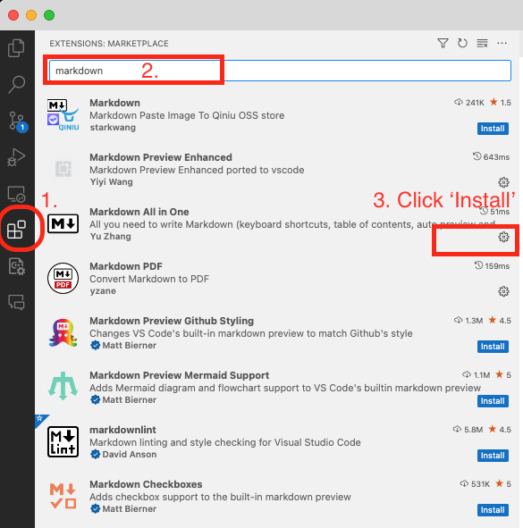
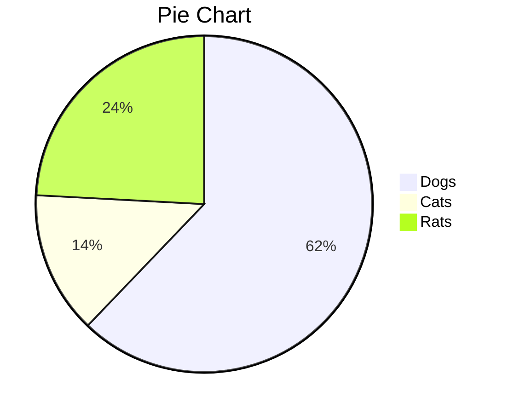
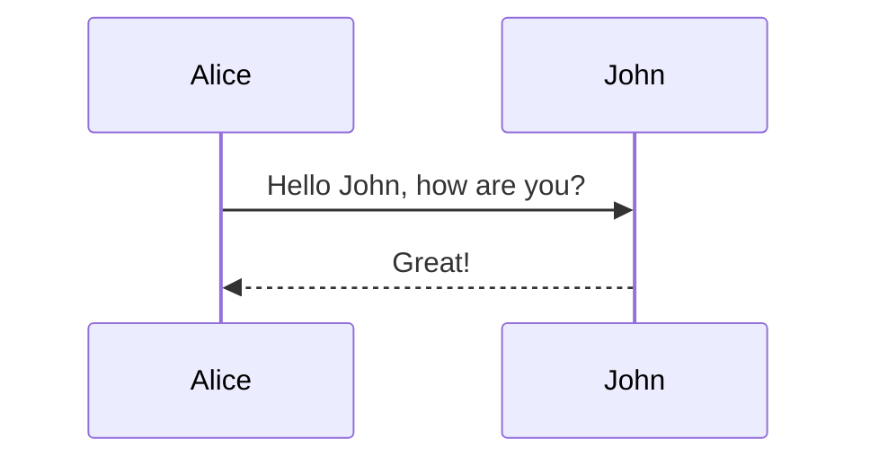
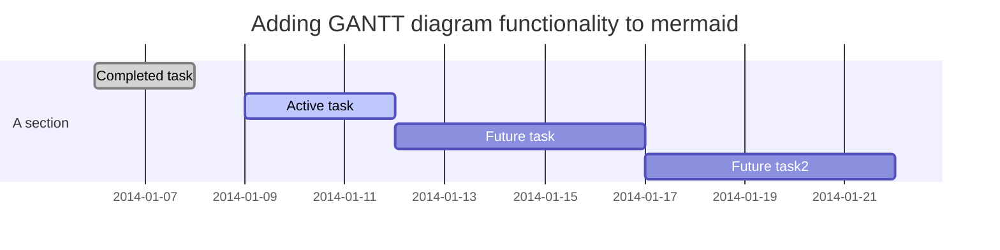

- [What is Markdown?](#what-is-markdown)
- [Which text editor to use?](#which-text-editor-to-use)
- [What to prepare if you want to use Visual Studio Code?](#what-to-prepare-if-you-want-to-use-visual-studio-code)
- [Notations of Markdown](#notations-of-markdown)
  - [Headers](#headers)
- [This is an h1 tag](#this-is-an-h1-tag)
  - [This is an h2 tag](#this-is-an-h2-tag)
          - [This is an h6 tag](#this-is-an-h6-tag)
  - [Emphasis](#emphasis)
  - [Lists](#lists)
    - [Unordered](#unordered)
    - [Ordered](#ordered)
  - [Images](#images)
  - [Math](#math)
  - [Inline code](#inline-code)
  - [Links](#links)
  - [Blockquotes](#blockquotes)
  - [Tables](#tables)
  - [Task Lists](#task-lists)
  - [Strikethrough](#strikethrough)
  - [Emoji](#emoji)
  - [Footnotes](#footnotes)
  - [Horizontal Rule](#horizontal-rule)
- [Draw Diagrams](#draw-diagrams)
  - [Flowchart](#flowchart)
  - [Pie Charts](#pie-charts)
  - [Sequence Diagram](#sequence-diagram)
  - [Gantt Diagram](#gantt-diagram)


# What is Markdown?

Markdown is a lightweight markup language with plain text formatting syntax designed so that it can be converted to HTML and many other formats using a tool by the same name. Markdown is often used to format readme files, for writing messages in online discussion forums, and to create rich text using a plain text editor.


# Which text editor to use?

Any text editor will do. You can use the text editor that comes with your operating system (TextEdit on Mac, Notepad on Windows) or a more advanced text editor such as [Sublime Text](https://www.sublimetext.com/), [Atom](https://atom.io/), [Notepad++](https://notepad-plus-plus.org/), [Visual Studio Code](https://code.visualstudio.com/), or [Brackets](http://brackets.io/). But my favorite is [Typora](https://typora.io/) and [Visual Studio Code](https://code.visualstudio.com/).

# What to prepare if you want to use Visual Studio Code?

1. Install [Visual Studio Code](https://code.visualstudio.com/).
2. Install [Markdown All in One](https://marketplace.visualstudio.com/items?itemName=yzhang.markdown-all-in-one) extension. *However this can be installed in Visual Studio Code Extensions tab directly.*
3. Install other extensions if you want to.




# Notations of Markdown

## Headers

```markdown
# This is an <h1> tag
## This is an <h2> tag
###### This is an <h6> tag
```

# This is an h1 tag
## This is an h2 tag
###### This is an h6 tag

## Emphasis

```markdown
*This text will be italic*
_This will also be italic_

**This text will be bold**
__This will also be bold__

_You **can** combine them_
```

*This text will be italic*
_This will also be italic_

**This text will be bold**
__This will also be bold__

_You **can** combine them_

## Lists

### Unordered

```markdown
* Item 1
* Item 2
  * Item 2a
  * Item 2b
```

* Item 1
* Item 2
  * Item 2a
  * Item 2b

### Ordered

```markdown
1. Item 1
2. Item 2
3. Item 3
   1. Item 3a
   2. Item 3b
```

1. Item 1
2. Item 2
3. Item 3
   1. Item 3a
   2. Item 3b

## Images

```markdown

```


## Math

```markdown
$$
\frac{n!}{k!(n-k)!} = \binom{n}{k}
$$
```

$$
\frac{n!}{k!(n-k)!} = \binom{n}{k}
$$

## Inline code

**C++**

```c++

#include <iostream>

int main()
{
    std::cout << "Hello World!\n";
}
```

**Python**

```python
print("Hello World!")
```

## Links

```markdown
https://www.google.com - automatic!
[Google](https://www.google.com )
```

https://www.google.com - automatic!
[Google](https://www.google.com )


## Blockquotes

```markdown
As Kanye West said:

> We're living the future so
> the present is our past.
```

As Kanye West said:

> We're living the future so
> the present is our past.


## Tables

```markdown
| Syntax | Description |
| ----------- | ----------- |
| Header | Title |
| Paragraph | Text |
```

| Syntax | Description |
| ----------- | ----------- |
| Header | Title |
| Paragraph | Text |


```markdown

| Syntax | Description |
| ---: | :----------- |
| Header | Title |
| Paragraph | Text |

```


| Syntax | Description |
| ---: | :----------- |
| Header | Title |
| Paragraph | Text |


## Task Lists

```markdown
- [x] Finish my changes
- [ ] Push my commits to GitHub
- [ ] Open a pull request
```

- [x] Finish my changes
- [ ] Push my commits to GitHub
- [ ] Open a pull request


## Strikethrough

```markdown
~~this~~
```

~~this~~

## Emoji

```markdown
:smile:
:sweat:
```

:smile:
:sweat:

For more information, you can refer to this emoji sheet: https://gist.github.com/rxaviers/7360908


## Footnotes

```markdown
Here's a sentence with a footnote. [^1]

[^1]: This is the footnote.
```

Here's a sentence with a footnote. [^1]

[^1]: This is the footnote.


## Horizontal Rule

```markdown
---
```

# Draw Diagrams

Here are some examples of diagrams that can be drawn using Markdown.

For more information, you can refer to this website: http://mermaid.js.org/intro/

## Flowchart

```markdown
graph TD;
    A-->B;
    A-->C;
    B-->D;
    C-->D;
```


## Pie Charts

```markdown
pie
    title Pie Chart
    "Dogs" : 386
    "Cats" : 85
    "Rats" : 150 
```





## Sequence Diagram

```markdown
sequenceDiagram
    Alice->>John: Hello John, how are you?
    John-->>Alice: Great!
```



## Gantt Diagram

```markdown
gantt
    dateFormat  YYYY-MM-DD
    title Adding GANTT diagram functionality to mermaid

    section A section
    Completed task            :done,    des1, 2014-01-06,2014-01-08
    Active task               :active,  des2, 2014-01-09, 3d
    Future task               :         des3, after des2, 5d
    Future task2               :         des4, after des3, 5d
```


